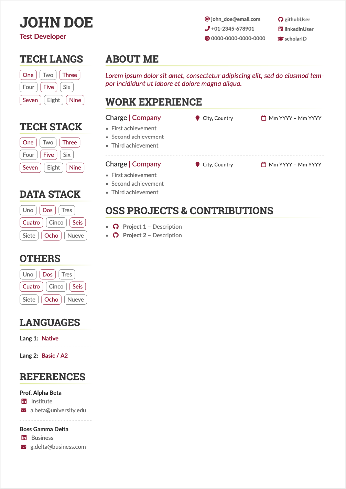
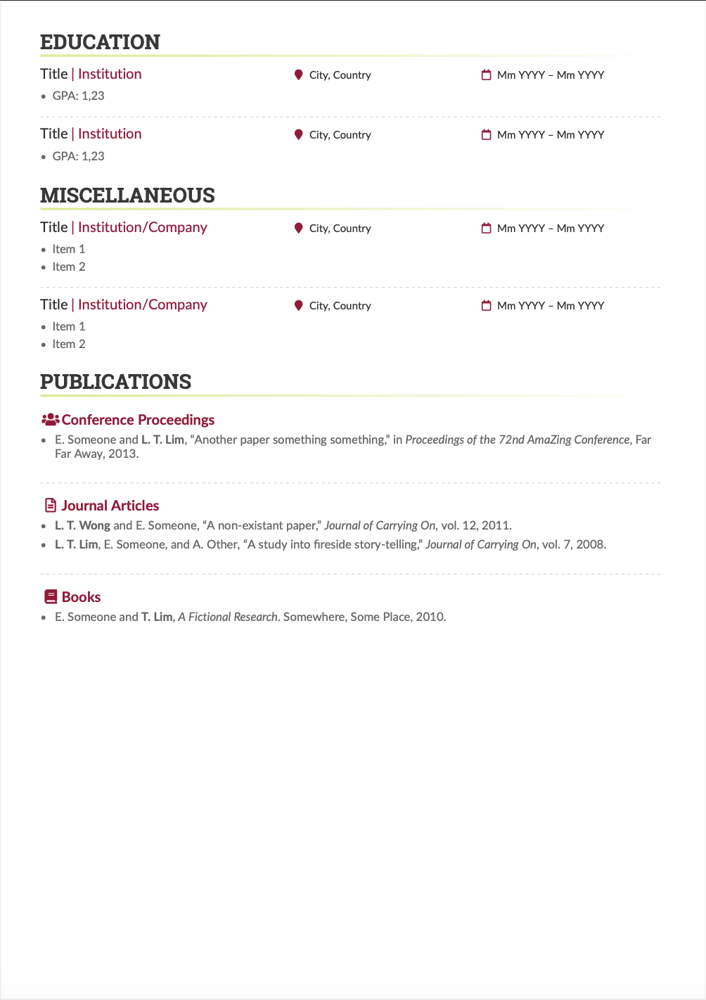

# AltaCV, yet another LaTeX CV/Résumé class | Forked by gcroci2

v1.7.1 (25 Aug 2023), by LianTze Lim (liantze@gmail.com)

v1.7.1b (11 Jan 2024), by Nicolás Omar González Passerino (nicolas.passerino@gmail.com)

v1.7.1c (7 Dec 2024), by Giulia Crocioni (crocioni.giulia@gmail.com)

## Original Sample

* Added \mynames{...} to specify names to be highlighted in the publication list on 3 Nov 2022

* v1.7 (9 Aug 2023) changes:
  - `\itemmarker` and `\ratingmarker` renamed to `\cvItemMarker` and `\cvRatingMarker`
  - Added `\cvLocationMarker` and `\cvDateMarker` so that these icons in `\cvevent`
    can be re-defined
  - Added `\locationname` and `\datename` for replacement text of the location and date
    markers in `\cvevent`
  - Other tweaks with `accsupp` (with another bugfix in v1.7.1.)
* Added `\mynames{...}` to specify names to be highlighted in the publication list on 3 Nov 2022
* Starred `\NewInfoField*` command to handle Mastodon; Icons, `\cvskills`, `\wheelchart` have "copyable" text values; `\cvskill` supports numerical values {0.5, 1, ..., 4.5, 5} on 21 May 2021
* Moved `biblatex`-related code to `*.cfg` files for easier edit on 8 May 2021
* Removed dependency on `academicons` on 12 Apr 2021
* Clickable hyperlinked info fields added on 10 May 2020
* Sample file with new `paracol` layout added on 2 February 2020

## Forked Sample

* `v1.7.1c` (7 Dec 2024):
  * **Added:** shade to the sections separation line, (google) `scholar` field, and a new section for open-source projects. Added cover letter template.
  * **Updated:** improved header spacing, aligned location and date icons across sections, updated color palette, and cv sections titles.
  * **Removed:** photo in the header, and the `darkmode` option.

* `v1.7.1b` (11 Jan 2024):
  * **Added:** (`markword`) tag created to change a word color using the assigned in `accent`.
  * **Updated:** (`cvtags` & `cvtag`) now includes a boolean flag to highlight its text and border among others of its type (useful to draw attention from main points).

* `v1.7.1a` (9 Jan 2024):
  * **Updated:** Résumé structure updated from changes from `v1.7.1`.

* `v1.6.5c` (27 Jun 2023):
  * **Added:** (`sloppypar`) environment added and improved to solve `\cvtag` list overlapping with `\cvsection` width.
  * **Added:** (`\cvtags`) tag created to parse several skills in tag/pill way in a less verbose way than before.

* `v1.6.5b` (27 Jun 2023):
  * **Updated:** (`\cvref`) tag rebuilt from the original version with optional display for *LinkedIn* and *Email* links.

* `v1.6.5a` and before (29 Jan 2023):
  * **Added:** New contact options added for dev.to, medium, and npm accounts.
  * **Added:** Adapted color scheme as well as `darkmode` (enable in line 31 of file `main.tex`).
  * **Added:** (`\cvlang`) tag added for languages rating, avoiding star/button/progress bar previous ideas, I made a simpler and more accurate representation using a single string, which will be colored to be oustanding.
  * **Updated:** (`\@makeaphoto`) The Photo image has been modified to include a border around it, which color is aligned with the document's theme.
  * **Updated:** (`\altacv@add@photo@left`) Horizontal space changed from 1ex to 6,5ex to align photo container width to smaller column width (25%).
  * **Updated:** (`\cvsection`) separation has been changed by adding 2 `\bigskip`.
  * **Updated:** (`\cvevent`) structure modified to include change title, company name, start/end dates and work location (only a string).
  * **Updated:** (`\cvtag`) items now have a more consistent vertical and horizontal separation.

### This is how the final version looks like

#### CV




#### Cover Letter


## Requirements and Compilation

* pdflatex + biber + pdflatex
* AltaCV uses [`fontawesome5`](http://www.ctan.org/pkg/fontawesome5).
* Use the `ragged2e` option to activate hyphenations while keeping text left-justified; line endings will thus be less jagged and more aesthetically pleasing.
* As of v1.3 the `withhyper` document class option will make the "personal info" fields into clickable hyperlinks (where it makes sense). See below for more details.
* Can now be compiled with pdflatex, XeLaTeX and LuaLaTeX!
  * Note that to compile with XeLaTeX, you should use a command line as follows, per [the `pdfx` documentation](http://mirrors.ctan.org/macros/latex/contrib/pdfx/pdfx.pdf): `xelatex -shell-escape -output-driver="xdvipdfmx -z 0" main.tex`
* The samples here use the [Lato](http://www.latofonts.com/lato-free-fonts/) and [Roboto Slab fonts](https://github.com/googlefonts/robotoslab). Feel free to use a different typeface package instead—often a different typeface will change the entire CV's feel.

## Clickable Info fields

As of v1.3, the `withhyper` document class option will load the `hyperref` package, and make fields in the personal detail fields into clickable hyperlinks (where it makes sense anyway).

*BIG CAVEAT:* Remember that not all readers may want to click on hyperlinks in PDFs. You may therefore sometimes want to _remove_ `withhyper`, and spell out the field URL details a bit more completely, e.g. `\github{github.com/your-id}`.

Anyway assuming that you _do_ keep `withhyper` enabled: For each field e.g. `\homepage{foobar.com}`, a `\homepagesymbol` has been defined, and the clickable hyperlink is generated by prepending the `\homepagehyperprefix` to `foobar.com`. The `\homepgehyperprefix` is defined to be `\https://`, so this generates the hyperlink `https://foobar.com`.

If your homepage doesn't use HTTPS yet, or if you want to use a different symbol, you can re-define them with
```latex
\renewcommand{\homepagehyperprefix}{http://}
\renewcommand{\homepagesymbol}{\faLink}
```


## New Information Fields ####

You can just typeset your own arbitrary information fields using the `\printinfo{symbol}{detail}[optional hyperlink prefix]` command within `\personalinfo`:

````latex
\printinfo{\faPaw}{Hey ho!}
\printinfo{\faGitLab}{your-handle}[https://gitlab.com/]
````

Or if you really prefer, you can define a new field yourself with `\NewInfoFiled{fieldname}{symbol}[optional hyperlink prefix]` before  using it:

````latex
\NewInfoField{gitlab}{\faGitlab}[https://gitlab.com/]
\gitlab{your_id}
````

For services and platforms like Mastodon where there isn't a straightforward relation between the more popular user ID or nickname and the hyperlink, you can use `\printinfo` directly e.g.

```latex
\printinfo{\faMastodon}{@username@instace}[https://instance.url/@username]
```

But if you absolutely want to create new dedicated info fields for such platforms, then use `\NewInfoField*` with a star:

```latex
\NewInfoField*{mastodon}{\faMastodon}
```

then you can use `\mastodon` with TWO arguments where the 2nd argument is the full hyperlink.

```latex
\mastodon{@username@instance}{https://instance.url/@username}
```


## Configurable colours

Use `\colorlet` or `\definecolor` to change these.
* `accent`
* `emphasis`
* `heading`
* `headingrule`
* `subheading`
* `body`
* `name`
* `tagline`

## Configurable fonts

Use `\renewcommand` to change these.
* `\namefont`
* `\taglinefont`
* `\personalinfofont`
* `\cvsectionfont`
* `\cvsubsectionfont`

## Configurable icons

Use `\renewcommand` to change these.
* `\cvItemMarker` (bullets for `itemize`)
* `\cvRatingMarker` (for `\cvskill`)
* `\cvDateMarker` (for date in `\cvevent`)
* `\cvLocationMarker` (for location in `\cvevent` and `\location`)


## Is this template ATS-friendly?
There is some discussion about this in issue #76. No actual claims are made, because we don't really know how each ATS system works. But this template uses `accsupp` to add replacement text for the icons, which may help — e.g. the `\faGithub` icon rendered in the PDF would copy-and-paste from Acrobat Reader, as exactly the text `\faGithub`. 

You could try running `pdftotext -raw sample.pdf` to view the text-only version of the CV, with the columnar layout removed.

Alternatively running `pdftotext -layout sample.pdf` to view the text-only version in a pseudo-two-column layout.

In particular `\locationname` and `\datename` hold the replacement text for the location and date/duration icon in `\cvevent`. These can be re-defined especially if your CV is in a non-English language, e.g. Spanish.

```latex
\renewcommand{\locationname}{Ubicación}
\renewcommand{\datename}{Fecha}
```

---

## `legacy/sample-old.tex` (for historical record only)

This was the original sample template file until 5 May 2020. The right sidebar is actually a _`marginpar`_, so it doesn't support footnote and cannot automatically break across pages if it's too long. You would need to split your right sidebar contents into separate files e.g. `p1sidebar.tex` and `p2sidebar.tex`, and insert them as the optional argument of the `\cvsection{...}` that you want to align them with:

```latex
\cvsection[p1sidebar]{Experience}
...
... END OF FIRST PAGE OF YOUR CV ...
\cvsection[page2sidebar]{Publications}
...
```

This assumes that the next page's main column would start immediately with a `\cvsection`, so that the top of your right sidebar contents also appear at the top of the page. Now if the _next_ page doesn't start with a `\cvsection` but you'd still like to add a sidebar, then use this command on the _current_ page to add it. The optional argument lets you pull up the sidebar a bit so that it looks aligned with the top of the main column:

```latex
\addnextpagesidebar[-1ex]{page3sidebar}
```

If you want to change the left and right columns' widths, you'll need to tinker with the `right` (distance from paper's right edge until the main column's right edge) and `marginparwidth` (width of the right sidebar) options in the `\geometry` line. For example, to make the right sidebar wider by 2cm, you could use

```latex
%% original was right=9cm, marginparwidth=6.8cm
\geometry{left=1cm,right=11cm,marginparwidth=8.8cm,marginparsep=1.2cm,top=1cm,bottom=1cm}
```
as well as doing a bit of arithmetic when you're making the header to get it full-width, i.e. reducing the sidebar by 2cm and extending the main column by 2cm.

```latex
\begin{adjustwidth}{}{-10cm}  %% original was -8cm
\makecvheader
\end{adjustwidth}
```